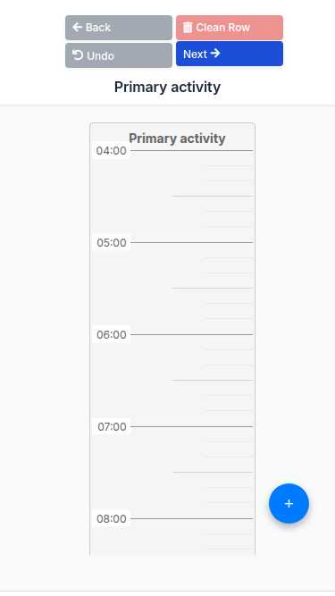

# O-ELIDDI - Daily Activity Collection Tool

A web-based tool for collecting and visualizing daily activities in a timeline format. Designed for research studies and time-use surveys.

## 🚀 Quick Start

- **[Live Demo](https://andreifoldes.github.io/timediary/index.html)** - Try the application
- **[Documentation](https://andreifoldes.github.io/timediary/docs/index.html)** - Complete setup and configuration guides

## Features

*   **Interactive Timeline Interface:**  Engage with your data through a dynamic timeline. Users can easily navigate and explore their activities with zoom and pan functionalities.
*   **Drag and Drop Activity Placement:**  Intuitively add and reposition activities directly on the timeline. This feature simplifies data entry and adjustments, making it user-friendly for participants.
*   **Mobile and Desktop Responsive Layouts:**  Access and use the tool seamlessly across various devices. Whether on a desktop for detailed analysis or a mobile device for on-the-go recording, the layout adapts to provide an optimal experience.
    - **Desktop Layout:** Features a full-width timeline with horizontal controls, optimized for precise mouse interactions and detailed data entry
    - **Mobile Layout:** Compact vertical layout with touch-friendly controls, optimized for finger navigation and thumb interaction
*   **Data Export Functionality:**  Export your collected data in common formats like CSV and JSON. This allows for easy integration with other analysis tools and research workflows.

## Screenshots

### Desktop Layout
The desktop version provides a comprehensive view with full-width timeline and horizontal navigation controls, designed for detailed data entry and analysis.

### Mobile Layout
The mobile version features a compact, touch-friendly interface with vertical controls optimized for smartphone usage and on-the-go data collection.

## Technology Stack

*   HTML
*   CSS
*   JavaScript

## Usage

### For Researchers

Researchers can utilize O-ELIDDI to:

*   **Design and deploy time-use studies:** Customize activity categories and study durations to fit specific research needs.
*   **Collect rich activity data:** Gather detailed information about participant's daily routines in a structured timeline format.
*   **Export data for analysis:** Easily export collected data in CSV or JSON formats for statistical analysis and visualization using other tools.

### For Participants

Participants can use O-ELIDDI to:

*   **Record daily activities:**  Log your daily activities in an intuitive timeline interface by simply dragging and dropping activities.
*   **Visualize time use:**  Gain insights into how your time is spent each day, week, or study period through interactive visualizations.
*   **Contribute to research:**  Participate in research studies and contribute valuable data on daily life patterns.

## Contributing

We welcome contributions to O-ELIDDI!

*   **Pull Requests:**  Feel free to submit pull requests for bug fixes, feature enhancements, or documentation improvements.
*   **Issue Reporting:**  For major changes or to report issues, please open an issue first to discuss the proposed changes.

## Browser Compatibility

### Minimum Browser Requirements (2020+)
- **Chrome:** Version 80 or later (early 2020) 
- **Firefox:** Version 75 or later (early 2020) 
- **Safari:** Version 13 or later (late 2019) 
- **Edge:** Version 80 or later (early 2020)
- **Brave:** Version 1.34 or later
- **Opera:** Version 67 or later (early 2020)

- **iOS Safari:** Version 13.4 or later (early 2020)
- **Chrome for Android:** Version 8 or later (late 2017)

### Technical Requirements
The application utilizes several modern web features:

#### JavaScript (ES6+)
- ES2017+ features (async/await)
- Native JavaScript modules (import/export)
- Optional chaining operator (`?.`) - ES2020
- Modern Web APIs (IntersectionObserver)

#### CSS (CSS3)
- Modern layout features (Flexbox with `gap`, Grid)
- CSS `clamp()` function
- `env(safe-area-inset-*)` for iOS safe areas
- `backdrop-filter` with `@supports` fallbacks

### Known Issues
- Internet Explorer: Not supported (any version)
- Legacy Edge (pre-Chromium): Not supported
- Firefox: Limited support for `env(safe-area-inset-*)` features
- Browsers from before mid-2021: May experience layout issues due to Flexbox `gap` support
- Mobile browsers older than 2021: May experience significant issues

## License

This project is open-source and available under the MIT License (see LICENSE file).
